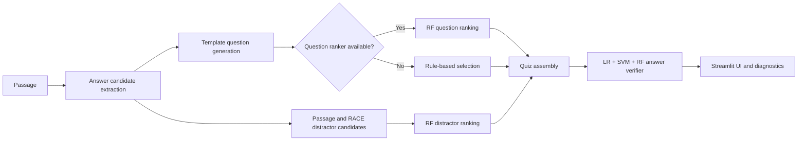

# RACE Quiz Studio

RACE Quiz Studio is an end-to-end reading-comprehension system that turns an
English passage into a four-option multiple-choice question. It combines
template-based question generation with trained ranking models, corpus-backed
distractor selection, graduated hints, and a Streamlit analytics dashboard.

## Highlights

- Generates a question, four shuffled options, and three progressively more
  specific hints from a supplied passage.
- Scores question candidates with an optional Random Forest ranker trained on
  RACE supervision.
- Ranks distractors with a Random Forest using edit distance, length,
  in-passage, and lexical-similarity features.
- Verifies answer options with a soft vote across Logistic Regression,
  calibrated SVM, and Random Forest models. Naive Bayes is trained and reported
  as a comparison model, but is excluded from the final vote.
- Uses the same 12-dimensional feature pipeline during training and inference:
  10 lexical/position features plus two K-Means cluster features.
- Includes a four-screen Streamlit interface for passage input, quiz answering,
  graduated hints, and model diagnostics.

## Architecture



The optional large artifacts have explicit fallbacks. A clean clone can run all
three bundled examples with the committed lightweight models. Adding the RACE
CSV enables dataset browsing and corpus-backed distractor retrieval; adding the
question-ranker and RF-verifier artifacts enables the full trained pipeline.

## Repository Layout

```text
.
├── features.py                  # Shared Model A feature engineering
├── question_ranker.py           # Candidate generation and ranker features
├── template_quiz_pipeline.py    # Quiz assembly and model wrappers
├── src/
│   ├── inference.py             # Public end-to-end inference facade
│   ├── preprocessing.py         # RACE loading and preprocessing
│   ├── model_a_train.py         # Verifier ensemble and T5 baseline training
│   ├── model_b_train.py         # Distractor-ranker training
│   ├── question_ranker_train.py # Question-ranker training
│   ├── evaluate.py              # Generated-quiz evaluation CLI
│   └── evaluate_distractors.py  # Distractor diagnostics CLI
├── ui/                          # Streamlit app and reusable UI helpers
├── tests/                       # Inference and training regression tests
├── notebooks/                   # Exploratory analysis
├── models/                      # Versioned lightweight model artifacts
├── data/                        # Local raw and processed data locations
└── report/report.pdf            # Project report and full references
```

## Quick Start

```bash
git clone git@github.com:OrbitalC2/AI_Quiz_Gen.git
cd AI_Quiz_Gen

python3 -m venv .venv
source .venv/bin/activate
python -m pip install -r requirements.txt

streamlit run ui/app.py
```

The app opens with a bundled Rosetta Stone passage. The first page load warms
the pipeline in a background thread; model loading may take a few seconds.

The RACE dataset is optional for the bundled examples. To browse RACE passages
or build the full distractor index, download the dataset and place the training
CSV at `data/raw/train.csv`:

- Dataset: <https://huggingface.co/datasets/ehovy/race>
- Expected columns: `article`, `question`, `A`, `B`, `C`, `D`, and `answer`

## Model Availability

| Component | Included in Git | Clean-clone behavior |
|---|---:|---|
| LR, calibrated SVM, and NB verifier models | Yes | LR + SVM soft vote |
| TF-IDF, IDF, K-Means, and SVD artifacts | Yes | Full 12-feature extraction |
| Model B RF distractor ranker | Yes | Ranks available passage distractors |
| RF verifier | No (116 MB) | Vote continues without RF |
| RF question ranker | No (44 MB) | Uses rule-based question selection |
| RACE distractor index | No (225 MB) | Uses passage candidates; all bundled examples remain runnable |
| T5-small weights | No (231 MB) | Neural comparison is reported unavailable |
| RACE `train.csv` | No (149 MB) | Dataset browser is disabled |

Large artifacts are intentionally ignored because they exceed or approach
GitHub's practical repository limits. Generate them with the training commands
below, or distribute them separately through a model registry or release asset.

## Training

Run commands from the repository root.

### Model A: answer verifier and T5 baseline

```bash
# Traditional models: LR, calibrated SVM, NB, RF, TF-IDF, K-Means, and SVD
python -m src.model_a_train \
  --task traditional \
  --train-csv data/raw/train.csv

# T5-small neural comparison baseline
python -m src.model_a_train \
  --task neural \
  --train-csv data/raw/train.csv

# Train both paths
python -m src.model_a_train \
  --task all \
  --train-csv data/raw/train.csv
```

Traditional artifacts are written to `models/model_a/traditional/`; T5 output
is written to `models/model_a/neural/model_a_final/`.

### Model B: distractor ranker

```bash
python -m src.model_b_train \
  --train-csv data/raw/train.csv \
  --sample-size 3000
```

The first run downloads `all-MiniLM-L6-v2` through `sentence-transformers`.
The trained ranker is saved as
`models/model_b/traditional/rfDistractorRanker.joblib`. The inference pipeline
builds and caches the corpus distractor index when the RACE CSV is present.

### Question ranker

```bash
python -m src.question_ranker_train \
  --train-csv data/raw/train.csv \
  --output-dir models/model_a/traditional
```

The ranker is saved as
`models/model_a/traditional/rfQuestionRanker.joblib`.

## Evaluation and Tests

```bash
# MCQ evaluation on the first 25 RACE rows
python -m src.evaluate --data data/raw/train.csv --limit 25

# Distractor quality and fallback diagnostics
python -m src.evaluate_distractors --data data/raw/train.csv --limit 25

# Regression suite
python -m pytest tests -v
```

The tests cover candidate extraction, template quality, option shuffling,
feature-vector shape, corpus-backed distractor filtering, ensemble membership,
and generation without external data artifacts.

## Reported Results

| Component | Metric | Value |
|---|---|---:|
| Verifier ensemble | MCQ accuracy | 36.5% (random baseline: 25%) |
| Verifier ensemble | Binary F1 | 0.376 |
| Logistic Regression | 5-fold cross-validation F1 | 0.526 ± 0.002 |
| RF question ranker | ROC-AUC | 0.972 |
| RF question ranker | Top-1 match rate | 66.9% |
| RF distractor ranker | Accuracy | 88.0% |
| RF distractor ranker | F1 | 0.83 |

These are recorded experiment results, not live benchmark runs. See
`report/report.pdf` for the project methodology and full discussion.

## Dataset Citation

Lai, G., Xie, Q., Liu, H., Yang, Y., & Hovy, E. (2017). *RACE: Large-scale
ReAding Comprehension Dataset From Examinations*. EMNLP 2017.
<https://aclanthology.org/D17-1082>
